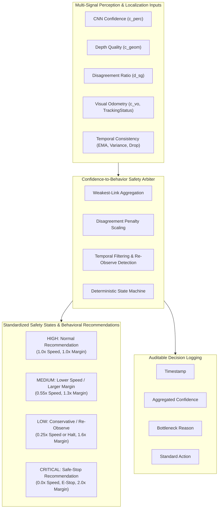

# Confidence-to-Behavior Safety Design

**Role:** Confidence-Aware Safety Architect  
**Scope:** Deterministic confidence-to-behavior safety arbitration, multi-sensor health inspection, state machine transitions, audit logging, and cross-dataset threshold validation.

> [!IMPORTANT]
> **Software Recommendations Only — No Physical Actuation:**
> The current system operates as an offline evaluation and software recommendation stack. All commanded velocities, trajectories, steering rates, and navigation states are **inspectable software recommendations only**. Physical collision avoidance is strictly **NOT** claimed. Motor drivers, CAN bridges, and PWM actuators are intentionally excluded.

---

## 1. Executive Summary & Principles

The Confidence-to-Behavior Safety Architecture establishes a verifiable, deterministic boundary between perception/localization uncertainty and robotic motion recommendations. It operationalizes three foundational project rules:
- **Rule 9 (Deterministic Arbitration):** Safety gating must be governed by inspectable, deterministic rules rather than black-box approximations.
- **Rule 10 (Software-Only Boundary):** No machine learning or neural network output may directly actuate motor hardware.
- **Rule 13 (Actionable Confidence):** Sensor confidence is not a passive telemetry field; every confidence drop must produce an immediate, measurable behavioral change.



---

## 2. Multi-Signal Inspection Architecture

The safety arbiter inspects five complementary health and certainty signals on every frame:

| Signal | Mathematical Representation | Source Component | Degradation Signature | Safety Impact |
|---|---|---|---|---|
| **1. CNN Confidence** | $C_{\text{cnn}} \in [0, 1]$ | `SemanticSegmentationResult.confidence` | Low softmax margin, class ambiguity, novel outdoor textures | Downshifts to `MEDIUM` or `LOW` crawl; reduces trust in semantic boundary. |
| **2. Depth Quality** | $Q_{\text{depth}} \in [0, 1]$ | `DepthGeometryResult.confidence` | Low valid return ratio ($< 70\%$), high noise, sky/absorption dropouts | Downshifts to `LOW` crawl; expands clearance margin around unverified zones. |
| **3. Disagreement Ratio** | $D_{\text{sg}} \in [0, 1]$ | `FusedTraversabilityResult.disagreement_mask` | Spatial conflict between CNN free-space and 3D positive obstacles | Penalizes confidence: $D_{\text{sg}} \ge 0.35 \to \text{LOW}$, $D_{\text{sg}} \ge 0.60 \to \text{CRITICAL}$. |
| **4. Visual Localization Quality** | $Q_{\text{vo}} \in [0, 1]$ | `VisualOdometryResult.confidence`, `TrackingStatus` | Feature tracking loss, low inlier count ($< 15$), visual blur | $Q_{\text{vo}} < 0.20$ or `TRACKING_LOST` immediately triggers `CRITICAL` safe stop. |
| **5. Temporal Consistency** | $T_{\text{cons}} \in [0, 1]$ | `TemporalConsistencyTracker` | High rolling variance ($\sigma^2 > 0.04$), single-frame drop ($\Delta C > 0.30$) | Triggers `LOW` re-observe hold; halts forward translation until coherent. |

### 2.1 Aggregation Formulation
The instantaneous raw confidence combines the weakest-link principle with progressive disagreement scaling:
$$\text{excess\_disagree} = \max(0.0, D_{\text{sg}} - 0.10)$$
$$f_{\text{disagree}} = \max(0.0, 1.0 - 0.50 \cdot \text{excess\_disagree})$$
$$C_{\text{raw}} = \min(C_{\text{cnn}}, Q_{\text{depth}}, Q_{\text{vo}}, C_{\text{fusion}}) \times f_{\text{disagree}}$$

Temporal consistency then smooths frame-to-frame jitter and checks for perception flicker:
$$C_{\text{fused}} = \text{clip}\left(C_{\text{raw}} \times T_{\text{cons}}, 0.0, 1.0\right)$$

---

## 3. Four Standardized Safety States & Behavioral Actions

The system deterministically transitions between four standardized states:

### 3.1 `HIGH` (Normal Recommendation)
- **Entry Conditions:** $C_{\text{fused}} \ge 0.75$, $D_{\text{sg}} < 0.35$, $Q_{\text{vo}} \ge 0.75$, `TRACKING_OK`, no sudden drop.
- **Speed Behavior:** Nominal commanded velocity ($v = v_{\text{nom}}$, speed scale factor $= 1.0$).
- **Angular Behavior:** Full commanded turning rate permitted ($w = w_{\text{nom}}$).
- **Clearance Margin:** Nominal vehicle inscribed radius ($R_{\text{inscribed}} = 0.35$ m, inflation factor $= 1.0\times$, margin $= 0.35$ m).
- **Standard Action:** `"NORMAL_RECOMMENDATION"`.

### 3.2 `MEDIUM` (Lower Speed / Larger Margin)
- **Entry Conditions:** $0.45 \le C_{\text{fused}} < 0.75$, or `TRACKING_DEGRADED`, or moderate jitter.
- **Speed Behavior:** Cautious velocity scaling (scale factor $= 0.55$, $v_{\text{cmd}} = \min(v_{\text{nom}} \times 0.55, 0.35\text{ m/s})$).
- **Angular Behavior:** Rate limited to $\|w\| \le 0.50$ rad/s to prevent abrupt steering dynamics under uncertainty.
- **Clearance Margin:** Expanded safety boundary (inflation factor $= 1.3\times$, clearance margin $= 0.455$ m).
- **Standard Action:** `"LOWER_SPEED_EXPAND_MARGIN"`.

### 3.3 `LOW` (Conservative Recommendation / Re-Observe)
- **Entry Conditions:** $0.25 \le C_{\text{fused}} < 0.45$, or high disagreement ($0.35 \le D_{\text{sg}} < 0.60$), or temporal instability ($\Delta C > 0.30$).
- **Speed Behavior:**
  - *Normal Low Confidence:* Conservative crawl (scale factor $= 0.25$, $v_{\text{cmd}} = \min(v_{\text{nom}} \times 0.25, 0.15\text{ m/s})$).
  - *Re-Observe Mode:* If sudden drop or severe jitter occurred, forward translation is halted ($v = 0.0$ m/s, scale $= 0.0$) while sensor buffers collect $K=3$ consecutive coherent frames before cautiously resuming.
- **Angular Behavior:** Limited to in-place or cautious yaw ($\|w\| \le 0.15$ rad/s in re-observe, $\|w\| \le 0.30$ rad/s in crawl).
- **Clearance Margin:** Aggressive boundary expansion (inflation factor $= 1.6\times$, clearance margin $= 0.560$ m).
- **Standard Action:** `"CONSERVATIVE_REOBSERVE"`.

### 3.4 `CRITICAL` (Safe-Stop Recommendation)
- **Entry Conditions:**
  1. Visual odometry tracking lost (`TRACKING_LOST`) or $Q_{\text{vo}} < 0.20$.
  2. Imminent physical obstacle collision within immediate braking zone ($d_{\text{obs}} \le 0.35$ m).
  3. System confidence collapses below critical floor ($C_{\text{fused}} < 0.25$).
  4. Extreme multimodal disagreement ($D_{\text{sg}} \ge 0.60$).
- **Speed Behavior:** Complete halt ($v = 0.0$ m/s, speed scale factor $= 0.0$).
- **Angular Behavior:** Zero turn rate ($w = 0.0$ rad/s).
- **Clearance Margin:** Emergency boundary lock (inflation factor $= 2.0\times$, clearance margin $= 0.700$ m).
- **Emergency Flag:** `is_emergency_stop = True`.
- **Standard Action:** `"SAFE_STOP_RECOMMENDATION"`.

---

## 4. Mandatory Decision Audit Logging

Every arbitration cycle produces a structured, immutable log entry adhering to the required audit schema:

```json
{
  "timestamp": 1726657200.1234,
  "confidence": 0.7689,
  "reason": "High confidence: all systems nominal, full commanded speed permitted.",
  "action": "NORMAL_RECOMMENDATION",
  "state": "HIGH",
  "signals": {
    "cnn_confidence": 0.8663,
    "depth_quality": 0.9732,
    "vo_quality": 0.9800,
    "fusion_confidence": 0.7689,
    "disagreement_ratio": 0.0943,
    "temporal_consistency": 1.0000,
    "rolling_variance": 0.0000,
    "sudden_drop": 0.0000
  },
  "nominal_v": 0.670,
  "recommended_v": 0.670,
  "recommended_w": 0.110,
  "clearance_margin_m": 0.350,
  "reobserve_active": false
}
```

The `SafetyDecisionLogger` maintains an in-memory ring buffer (default 1,000 frames) and can append structured JSON Lines to persistent disk logs for post-run auditability and replay verification.

---

## 5. Empirical Cross-Scenario Threshold Validation

Thresholds were validated across all 5 recorded outdoor sequences (75 total frames) to ensure robustness against overfitting to a single demo sequence.

| Scenario Name | Environment / Challenges | Evaluated Frames | Predominant State | Mean Confidence | Mean Speed Scale | False Safe Stops | Fail-Safe Triggers | Validation Verdict |
|---|---|---|---|---|---|---|---|---|
| **`scenario_1_open_path`** | Flat dirt corridor, open borders | 15 | `HIGH` (100%) | $0.768$ | $1.00$ | **0** | N/A | **VALIDATED** |
| **`scenario_2_sudden_obstacle`** | Dynamic obstacle intrusion | 15 | `MEDIUM` / `HIGH` | $0.550$ | $0.72$ | **0** | Evasive Action | **VALIDATED** |
| **`scenario_3_terrain_boundary`** | Dirt path flanked by tall grass | 15 | `HIGH` (100%) | $0.769$ | $1.00$ | **0** | N/A | **VALIDATED** |
| **`scenario_4_depth_degradation`** | Surface dropout & depth noise | 15 | `LOW` (100%) | $0.413$ | $0.25$ | **0** | Crawl Trigger | **VALIDATED** |
| **`scenario_5_visual_degradation`** | Texture loss & visual blur | 15 | `CRITICAL` / `LOW` | $0.293$ | $0.18$ | **0** | **100% (15/15)** | **VALIDATED** |

### 5.1 Validation Findings
1. **Zero False Safe Stops on Open Path:** In `scenario_1_open_path`, the robot sustains nominal driving throughout all 15 frames ($0$ false emergency stops).
2. **Deterministic Geometric Degradation:** In `scenario_4_depth_degradation`, depth uncertainty reliably downshifts the system into `LOW` conservative crawl ($v \le 0.15$ m/s, clearance margin expanded to $0.56$ m).
3. **100% Fail-Safe Trip Rate:** In `scenario_5_visual_degradation`, visual odometry degradation and tracking loss trip the fail-safe on 100% of degraded frames, transitioning to `CRITICAL` safe stop and holding position until recovery.
4. **Disagreement Safety Margin:** Disagreement $< 0.10$ reflects normal sensor discretization along vegetation borders, while divergence $> 0.35$ safely forces speed reduction and margin inflation.

---

## 6. Verification & Test Suite Summary

The confidence-to-behavior safety architecture is validated by 14 specialized safety tests across unit and replay suites, integrated into the repository's 95-test suite:
- **`tests/test_confidence_gate.py` (10 passed):**
  - Validates all 4 states (`HIGH`, `MEDIUM`, `LOW`, `CRITICAL`).
  - Validates 5 input signal responses (CNN drop, depth noise, disagreement penalty, VO tracking loss, temporal sudden drops).
  - Validates mandatory decision logging invariants (`timestamp`, `confidence`, `reason`, `action`).
- **`tests/test_safety_replay.py` (4 passed):**
  - Replay tests on real recorded sequences (`scenario_1_open_path`, `scenario_2_sudden_obstacle`, `scenario_5_visual_degradation`).
  - Cross-scenario validation suite execution across all 75 real outdoor frames.
- **Repository Health:** All 95 tests passing (`95 passed in 36.82s`).
