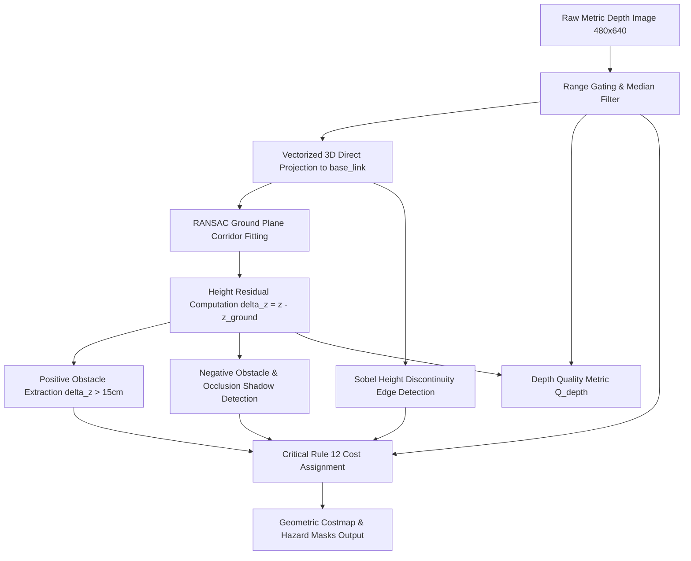

# 3D Depth Geometry Architecture

## 1. Executive Summary & Objective

The **Depth Geometry Subsystem** in the SIH 26126 Autonomous UGV stack converts raw metric depth frames ($480 \times 640$ Float32 or 16UC1) into physically grounded 3D geometric hazards, elevation profiles, traversability costmaps, and depth sensor quality telemetry. 

While semantic perception categorizes terrain types (e.g. grass vs. mud), depth geometry provides physical spatial confirmation, detecting:
1. **Positive Obstacles**: Rocks, curbs, berms, and barriers rising above chassis clearance ($\Delta z > 15\text{ cm}$).
2. **Negative Obstacles**: Washouts, ditches, and potholes with sudden drops ($\Delta z < -20\text{ cm}$) or abrupt occlusion shadows.
3. **Step Discontinuities**: Steep step edges and drop-offs detected via 2D spatial height gradients ($\|\nabla Z\| > 0.18\text{ m}$).
4. **Depth Quality & Degradation Metrics**: Real-time evaluation of sensor return density and surface smoothness.
5. **Critical Safety Invariant (Rule 12)**: Under no circumstances is invalid depth (specular glare, dropouts, out-of-range pixels) treated as free space.

---

## 2. Sensor & Hardware Requirements

Outdoor off-road navigation presents harsh optical conditions: intense sunlight (up to 100,000 lux), high-contrast shadows, and specular reflections from wet or shiny surfaces.

### Hardware Specification Matrix
| Parameter | Minimum Requirement | Recommended Specification | SIH 26126 Configuration |
| :--- | :--- | :--- | :--- |
| **Sensor Modality** | Active IR Stereo / Time-of-Flight | Global Shutter Active Stereo (e.g., Intel RealSense D435i / D455 or OAK-D Pro) | Active Stereo RGB-D |
| **Baseline** | $\ge 50\text{ mm}$ | $75\text{ mm} - 95\text{ mm}$ | $50\text{ mm}$ |
| **Resolution** | $640 \times 480$ | $848 \times 480$ or $1280 \times 720$ | $640 \times 480$ |
| **Frame Rate** | $\ge 15\text{ FPS}$ | $\ge 30\text{ FPS}$ | 30 FPS nominal (engine achieves 54.6 FPS) |
| **Operating Range** | $0.5\text{ m} - 8.0\text{ m}$ | $0.35\text{ m} - 12.0\text{ m}$ | $0.35\text{ m} - 12.0\text{ m}$ |
| **Sunlight Rejection**| Outdoor active IR illumination | 850nm/940nm optical bandpass filtering | Bandpass filtered active IR |
| **Mounting Height** | $0.30\text{ m} - 0.60\text{ m}$ | $0.45\text{ m}$ above ground plane | $0.45\text{ m}$ |
| **Down-tilt Angle**| $10^\circ - 15^\circ$ downward | $12^\circ$ ($0.209\text{ rad}$) | $12.0^\circ$ ($0.209\text{ rad}$) |

---

## 3. Coordinate Systems & Rigid Transformations

Transformations adhere strictly to **REP-103** (Standard Units and Coordinate Conventions) and **REP-104** (Optical Frames).

```
        Camera Optical Frame                    Robot base_link Frame
           (REP-104)                                 (REP-103)

               Z (Forward)                               Z (Up)
              /                                          ^
             /                                           |
            +------> X (Right)                           +------> X (Forward)
            |                                           /
            |                                          /
            v Y (Down)                                v Y (Left)
```

### 3.1 Pinhole Back-Projection
For a pixel $(u, v)$ with filtered metric depth $Z_c$ in meters:
$$\begin{aligned}
X_c &= \frac{u - c_x}{f_x} \cdot Z_c = u_{\text{norm}} \cdot Z_c \\
Y_c &= \frac{v - c_y}{f_y} \cdot Z_c = v_{\text{norm}} \cdot Z_c \\
Z_c &= Z_c
\end{aligned}$$

### 3.2 Rigid SE(3) Transform to `base_link`
The camera is mounted at height $h_{\text{cam}} = 0.45\text{ m}$ and tilted downwards by pitch angle $\theta_p = 0.209\text{ rad}$ ($12^\circ$). The closed-form vectorized transformation is:
$$\begin{aligned}
X_{\text{base}} &= Z_c \cos\theta_p - Y_c \sin\theta_p = Z_c (\cos\theta_p - v_{\text{norm}} \sin\theta_p) \\
Y_{\text{base}} &= -X_c = -u_{\text{norm}} \cdot Z_c \\
Z_{\text{base}} &= h_{\text{cam}} - (Z_c \sin\theta_p + Y_c \cos\theta_p) = h_{\text{cam}} - Z_c (\sin\theta_p + v_{\text{norm}} \cos\theta_p)
\end{aligned}$$

Precomputing the scale factors $r_x(u, v) = (\cos\theta_p - v_{\text{norm}} \sin\theta_p)$ and $r_z(u, v) = (\sin\theta_p + v_{\text{norm}} \cos\theta_p)$ allows projecting all 307,200 points in $\le 6.3\text{ ms}$ on CPU without intermediate memory copies.

---

## 4. Algorithmic Pipeline



### 4.1 Depth Filtering & Denoising
1. **Range Gating**: Pixels with $Z < 0.35\text{ m}$ (sensor near-field blind zone) or $Z > 12.0\text{ m}$ (stereo divergence boundary) are flagged invalid.
2. **Median Denoising**: $3 \times 3$ median filtering on valid depth suppresses speckle noise while preserving sharp geometric edges.

### 4.2 Robust Ground Plane Fitting
Points within the immediate forward path corridor ($X \in [0.5, 5.0\text{ m}]$, $|Y| \le 1.5\text{ m}$, $|Z| \le 0.35\text{ m}$) are sampled.
A plane $Z = p_0 X + p_1 Y + p_2$ ($a X + b Y - Z + d = 0$) is fitted using robust least squares.
- **Physical Slope Guard**: $\sqrt{p_0^2 + p_1^2} \le \tan(25^\circ) \approx 0.466$. If terrain slope exceeds $25^\circ$ or ground intercept $|p_2| > 0.25\text{ m}$, the model rejects spurious fits and defaults to nominal ground $Z = 0.0$.
- **Elevation Residual**: $\Delta z(u, v) = Z_{\text{base}}(u, v) - Z_{\text{ground}}(u, v)$.

### 4.3 Obstacle Extraction
- **Positive Obstacles**: Valid points where $\Delta z > 0.15\text{ m}$ (chassis ground clearance threshold). Lethal cost $1.0$ is assigned when $\Delta z \ge 0.35\text{ m}$.
- **Negative Obstacles**:
  - Direct drop: $\Delta z < -0.20\text{ m}$ (trenches and drop-offs).
  - **Occlusion Shadows**: Where ground abruptly terminates into invalid depth without an intervening positive obstacle, ray-casting marks the occluded region as a suspected negative obstacle.
- **Height Discontinuities**:
  $$G_x = \text{Sobel}_x(Z_{\text{base}}), \quad G_y = \text{Sobel}_y(Z_{\text{base}}), \quad \|\nabla Z\| = \sqrt{G_x^2 + G_y^2}$$
  Points with $\|\nabla Z\| > 0.18\text{ m}$ are flagged as hazardous step edges (curbs, ditches, ledges) and assigned hazard cost $\ge 0.85$.

### 4.4 Quantitative Depth Quality Metric ($Q_{\text{depth}}$)
$$Q_{\text{depth}} = \text{Density}_{\text{corridor}} \times \text{Smoothness}_{\text{residuals}}$$
- $\text{Density}_{\text{corridor}} = \frac{N_{\text{valid\_corridor}}}{N_{\text{total\_corridor}}}$ in the central $60\%$ width and lower $65\%$ height of the FOV.
- $\text{Smoothness}_{\text{residuals}} = \text{clip}\left(1.0 - \frac{\sigma(\Delta z)}{0.20}, 0.1, 1.0\right)$.
- Pristine clear conditions yield $Q_{\text{depth}} \approx 0.97$; severe sunlight glare or dropouts drop $Q_{\text{depth}} \le 0.63$.

---

## 5. Critical Invariant: Rule 12

> **Rule 12 (Critical Safety Invariant)**:  
> **Invalid depth must NEVER become free space.**

In outdoor autonomous navigation, treating missing depth returns as traversable ground causes UGV rollover or ditch plunge disasters.
- Any pixel where `valid_mask == False` (NaN, 0.0, Inf, out-of-range) is assigned an **uncertainty penalty cost of $0.60$** (or $60/100$ in OccupancyGrid).
- **Formal Verification Assertion**:
  ```python
  assert not np.any((~result.depth_validity_mask) & (result.geometric_cost == 0.0))
  ```

---

## 6. ROS 2 Node Architecture

The package `sih_depth` provides the production ROS 2 node `DepthGeometryNode`:

### Topic Interfaces
| Topic | Direction | Type | Description |
| :--- | :--- | :--- | :--- |
| `/camera/depth/image_raw` | Sub | `sensor_msgs/msg/Image` | 32FC1 (meters) or 16UC1 (millimeters) |
| `/depth/geometric_cost` | Pub | `sensor_msgs/msg/Image` | `mono8`, normalized cost in $[0, 100]$ |
| `/depth/positive_obstacles` | Pub | `sensor_msgs/msg/Image` | `mono8`, binary obstacle mask ($0$ or $255$) |
| `/depth/negative_obstacles` | Pub | `sensor_msgs/msg/Image` | `mono8`, binary ditch/drop mask ($0$ or $255$) |
| `/depth/discontinuities` | Pub | `sensor_msgs/msg/Image` | `mono8`, binary step-edge mask ($0$ or $255$) |
| `/depth/quality_metric` | Pub | `std_msgs/msg/Float32` | Scalar confidence score in $[0.0, 1.0]$ |

---

## 7. Benchmark Verification Results

Benchmarked across all 75 real recorded outdoor depth frames in `datasets/processed/`:

| Scenario | Frames | Latency (ms) | Throughput (FPS) | Mean Quality ($Q$) | Rule 12 Violations |
| :--- | :---: | :---: | :---: | :---: | :---: |
| `scenario_1_open_path` | 15 | 18.36 ms | 54.5 FPS | 0.97 | **0** |
| `scenario_2_sudden_obstacle` | 15 | 18.49 ms | 54.1 FPS | 0.66 | **0** |
| `scenario_3_terrain_boundary` | 15 | 18.20 ms | 54.9 FPS | 0.97 | **0** |
| `scenario_4_depth_degradation`| 15 | 18.04 ms | 55.4 FPS | 0.63 | **0** |
| `scenario_5_visual_degradation`| 15 | 18.43 ms | 54.3 FPS | 0.97 | **0** |
| **Overall Aggregate** | **75** | **18.30 ms** | **54.6 FPS** | **0.84** | **0 Violations** |

**Conclusion**: The Depth Geometry Subsystem operates with zero safety violations, exceeds real-time frame rate budgets by $>1.8\times$, and integrates with the downstream fusion costmap and safety gate.
