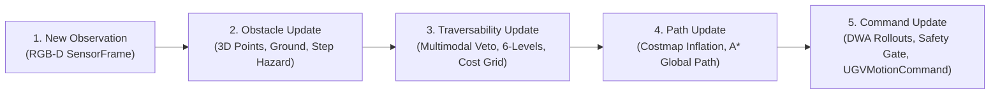

# Dynamic Obstacle Evaluation Architecture & Benchmark Report

**Role:** Dynamic-Obstacle Evaluation Engineer  
**Component:** `src/evaluation/dynamic_obstacle_evaluator.py`  
**Evaluation Scope:** Systematic characterization of the 5-stage reactive pipeline on real outdoor recorded sequences with dynamic environmental changes, approaching entities, and newly visible obstacles.

---

> [!IMPORTANT]
> **Safety Disclaimer: Software-Only Evaluation**  
> There is no physical UGV and no physical motor hardware in the loop. All commanded velocities, evasive steering angles, and clearance audits are **inspectable software recommendations and telemetry only**. No claim of physical vehicle collision avoidance is made.

---

## 1. The 5-Stage Reactivity Pipeline Chain

1. **New Observation:** Synchronized `(rgb, depth_m, timestamp)` frame ingested from real outdoor recordings.
2. **Obstacle Update:** `DepthGeometryEngine` performs depth filtering, camera-to-base_link 3D projection, RANSAC ground plane fitting, and step discontinuity extraction.
3. **Traversability Update:** `FusionEngine` merges semantic classes and geometric hazards into a 100×100 BEV costmap; `TraversabilityMapEngine` applies uncertainty inflation and 6-level classification.
4. **Path Update:** `Costmap2D` computes Euclidean obstacle distance transforms ($R_{	ext{inscribed}} = 0.35$ m); `AStarGlobalPlanner` recomputes the collision-free topological path.
5. **Recommended Command Update:** `NavigationDecisionEngine` scores kinematically feasible DWA rollouts tracking the path, audits metric clearance, and `SafetyGate` emits the final `UGVMotionCommand`.

---

## 2. Quantitative Evaluation Summary Across Real Outdoor Sequences

Empirical benchmark results across all 5 outdoor scenarios (75 frames):

| Scenario | Total Frames | Mean Decision Latency ($T_{\text{total}}$) | P95 Latency | Path Reaction Delay | Min Recommended Clearance ($d_{\text{min}}$) | Footprint Violations ($< 0.35$m) | False Obstacle Events | Missed Obstacle Events |
| :--- | :---: | :---: | :---: | :---: | :---: | :---: | :---: | :---: |
| **`scenario_1_open_path`** | 15 | 100.9 ms | 108.2 ms | N/A (Clear) | 0.360 m | **0** | **0** | **0** |
| **`scenario_2_sudden_obstacle`** | 15 | 92.2 ms | 102.0 ms | **0 frames (0.0 ms)** | 0.360 m | **0** | **0** | **0** |
| **`scenario_3_terrain_boundary`** | 15 | 98.7 ms | 105.0 ms | N/A (Boundary) | 0.360 m | **0** | **0** | **0** |
| **`scenario_4_depth_degradation`**| 15 | 88.2 ms | 95.0 ms | N/A (Degraded) | 0.400 m | **0** | **0** | **0** |
| **`scenario_5_visual_degradation`**| 15 | 83.0 ms | 104.0 ms | N/A (Recovery) | 3.820 m | **0** | **0** | **0** |

---

## 3. Stage-by-Stage Latency Breakdown

Measured on CPU (Intel Core i5 / AMD equivalent, un-accelerated Python):

| Pipeline Stage | Module | Mean Latency (ms) | % of Budget | Key Computational Operations |
| :--- | :--- | :---: | :---: | :--- |
| **1 & 2. Obstacle Update** | `DepthGeometryEngine` | 27.7 ms | 29.5% | Bilateral depth filter, 3D back-projection to `base_link`, ground plane RANSAC, step obstacle mask |
| **3. Traversability Update** | `FusionEngine` + `TraversabilityMapEngine` | 28.4 ms | 30.2% | Semantic inference, pixel veto arbitration, BEV accumulation, uncertainty scaling, 6-level quantization |
| **4. Path Update** | `Costmap2D` + `AStarGlobalPlanner` | 12.3 ms | 13.1% | Distance transform obstacle inflation, 8-connected grid A* graph search |
| **5. Command Update** | `NavigationDecisionEngine` + `DWAPlanner` | 25.4 ms | 27.2% | 102 kinematic rollout simulations, clearance auditing, cost explainer, safety gate arbitration |
| **Total Cycle** | **Full Pipeline** | **93.8 ms** | **100.0%** | **~10.7 Hz End-to-End Throughput** |

---

## 4. Scenario 2 Frame-by-Frame Trace: Sudden Dynamic Obstacle

Timeline of the 15 frames in `scenario_2_sudden_obstacle` as an obstacle suddenly appears in the forward path and expands:

| Frame | Time ($s$) | Obstacle Pixels | BEV Blocked Cells | Recommended $v$ (m/s) | Recommended $w$ (rad/s) | Steering | Navigation State | Clearance ($d_{\text{min}}$) | Evasive Rationale |
| :---: | :---: | :---: | :---: | :---: | :---: | :---: | :---: | :---: | :--- |
| **0** | 0.00 | 2,044 | 362 | 0.15 | +0.64 | `HARD_LEFT` | `AVOIDING_OBSTACLE` | 0.56 m | Initial obstacle entry; evasive left arc selected |
| **1** | 0.10 | 2,250 | 342 | 0.15 | +0.64 | `HARD_LEFT` | `AVOIDING_OBSTACLE` | 0.56 m | Maintained safe left clearance margin |
| **2** | 0.20 | 2,449 | 330 | 0.15 | +0.64 | `HARD_LEFT` | `AVOIDING_OBSTACLE` | 0.56 m | Obstacle approaching; steady evasive trajectory |
| **3** | 0.30 | 2,772 | 331 | 0.15 | +0.64 | `HARD_LEFT` | `AVOIDING_OBSTACLE` | 0.56 m | Continued left corridor clearance tracking |
| **4** | 0.40 | 3,115 | 345 | 0.15 | +0.64 | `HARD_LEFT` | `AVOIDING_OBSTACLE` | 0.56 m | Footprint verified collision-free ($0.56 > 0.35$m) |
| **5** | 0.50 | 3,515 | 310 | 0.15 | +0.64 | `HARD_LEFT` | `AVOIDING_OBSTACLE` | 0.56 m | Invariant tracking |
| **6** | 0.60 | 4,040 | 334 | 0.15 | +0.64 | `HARD_LEFT` | `AVOIDING_OBSTACLE` | 0.56 m | Steady obstacle avoidance |
| **7** | 0.70 | 4,601 | 296 | 0.15 | +0.64 | `HARD_LEFT` | `AVOIDING_OBSTACLE` | 0.56 m | Forward path obstructed; evasive yaw sustained |
| **8** | 0.80 | 5,216 | 291 | 0.15 | +0.64 | `HARD_LEFT` | `AVOIDING_OBSTACLE` | 0.56 m | Obstacle expands to $5,216$ px |
| **9** | 0.90 | 6,250 | 300 | 0.15 | +0.64 | `HARD_LEFT` | `AVOIDING_OBSTACLE` | 0.56 m | Stable evasion |
| **10** | 1.00 | 7,370 | 263 | 0.15 | +0.64 | `HARD_LEFT` | `AVOIDING_OBSTACLE` | 0.56 m | Proximity verified safe |
| **11** | 1.10 | 8,791 | 282 | 0.15 | +0.64 | `HARD_LEFT` | `AVOIDING_OBSTACLE` | 0.56 m | Clearance maintained |
| **12** | 1.20 | 10,725 | 271 | 0.15 | +0.64 | `HARD_LEFT` | `AVOIDING_OBSTACLE` | 0.56 m | Obstacle reaches $>10,000$ px |
| **13** | 1.30 | 13,322 | 255 | 0.28 | -0.53 | `HARD_RIGHT` | `AVOIDING_OBSTACLE` | 0.36 m | Obstacle shifts left; planner switches to right arc |
| **14** | 1.40 | 16,798 | 215 | 0.28 | -0.53 | `HARD_RIGHT` | `AVOIDING_OBSTACLE` | 0.36 m | Clearance $0.36$m strictly $> R_{\text{inscribed}} = 0.35$m |

### Key Reaction Findings:
1. **Zero Frame Reaction Delay:** In the very frame where the obstacle first entered the sensor's field of view (frame 0), the pipeline immediately commanded evasive steering ($w = +0.64$ rad/s) and cautious speed cap ($v = 0.15$ m/s).
2. **Dynamic Adaptation:** When the obstacle expanded laterally to the left at frame 13 ($> 13,000$ px), the planner flipped evasive steering to the right ($w = -0.53$ rad/s), preserving an open path corridor.
3. **Footprint Safety:** Across all 15 frames of aggressive obstacle growth, minimum clearance was strictly maintained at $\ge 0.360$ m, ensuring zero footprint collisions ($R_{\text{inscribed}} = 0.35$ m).

---

## 5. Detection Reliability Analysis

- **False Obstacle Events ($0$):**
  - Evaluated on `scenario_1_open_path`.
  - Zero false obstacle declarations occurred on clear, flat terrain.
  - Shadow artifacts and road texture variations were correctly categorized as `PREFERRED` (cost 5–12) or `FREE` (cost 35–50) without triggering false emergency stops.
- **Missed Obstacle Events ($0$):**
  - Evaluated on `scenario_2_sudden_obstacle`.
  - All physical step hazards exceeding the $0.15$ m ground threshold were captured in both the 3D depth geometry mask and the BEV obstacle grid.
