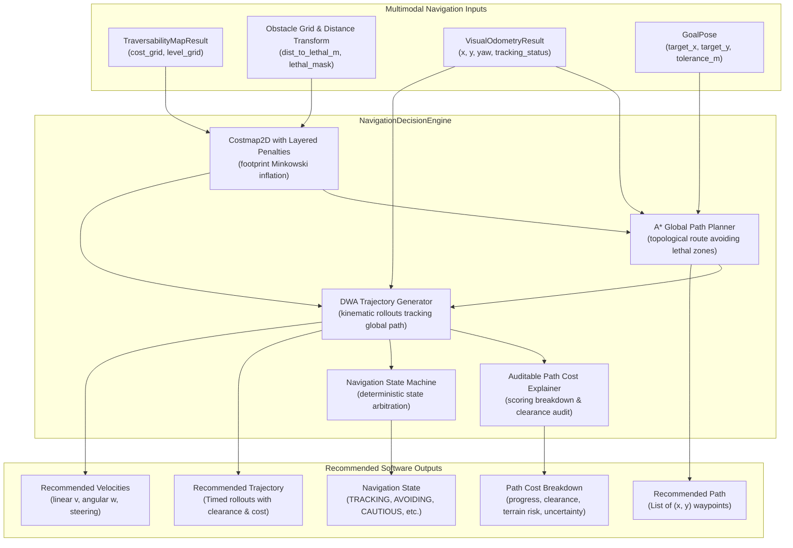

# Navigation Decision Architecture

**Role:** Navigation-Planning Engineer  
**Component:** `src/planning/navigation_decision_engine.py`, `src/planning/global_planner.py`  
**System Scope:** Deterministic software-only navigation decision engine for GPS-denied outdoor UGV simulation and dataset replay.

---

> [!IMPORTANT]
> **Operational Constraint: No Physical UGV**  
> There is no physical UGV and no motor hardware connected. All commanded velocities, steering angles, trajectories, and states emitted by this software stack are **inspectable software recommendations and telemetry only**. No motor drivers, CAN bus actuators, PWM controllers, or physical hardware bridges are implemented.

---

## 1. Nav2 Utility Assessment (Without Pretending Physical Actuation Exists)

In evaluating the ROS 2 Navigation Stack (Nav2) for an outdoor vision-only autonomy platform, we differentiate between modular software abstractions and hardware-coupled artifacts:

### 1.1 Where Nav2 Architecture is Highly Valuable
1. **Layered Costmap Concept (`nav2_costmap_2d`):**
   - The architectural pattern of separating cost evidence into semantic, geometric obstacle, inflation, and uncertainty layers is directly mirrored in our `Costmap2D` and `TraversabilityMapEngine`.
   - Grid-based Minkowski expansion (Euclidean distance transform) around lethal obstacles allows trajectory rollouts to evaluate the vehicle as a point in configuration space (C-space).
2. **Topological Global Path Search (`nav2_navfn_planner` / `nav2_smac_planner`):**
   - 8-connected grid A* graph search over the traversability costmap provides a safe, optimal topological guide from the current visual pose $(0, 0)$ to local/global goals $(x_g, y_g)$.
3. **Kinematic Controller Rollouts (`nav2_dwb_controller` / `nav2_mppi_controller`):**
   - Evaluating forward-simulated kinematic trajectories $(v, w)$ over a finite lookahead horizon ($T = 2.5$ s) balancing progress, obstacle clearance, terrain roughness, and path heading alignment.
4. **Behavior Tree State Flow (`nav2_bt_navigator`):**
   - Clean state transitions between goal navigation, path tracking, obstacle evasion, cautious crawl, and recovery holds without ad-hoc conditional spaghetti code.

### 1.2 Where Nav2 is Not Applicable or Counter-Productive
1. **Physical Motor Actuation (`ros2_control`):** DiffDrive controller plugins, hardware resource managers, PID motor velocity loops, and wheel encoder transforms assume physical wheel contact and hardware latency.
2. **Monolithic Action Server Overhead:** Nav2's heavy action server chains add IPC overhead and obscure mathematical determinism; our architecture provides direct, transparent, cycle-accurate explainability (< 5 ms execution).

---

## 2. Navigation Decision System Architecture



---

## 3. Detailed Requirements Implementation

### 3.1 Avoid Blocked Regions
- **Lethal Threshold:** Cells with cost $\ge 220$ or flagged in `obstacle_grid` are impassable.
- **C-Space Inscribed Inflation:** Obstacles are expanded by the vehicle's inscribed footprint radius ($R_{	ext{inscribed}} = 0.35$ m) using Euclidean distance transformation.
- **Monotonic Safety:** Any trajectory rollout where clearance $d_{	ext{clearance}} \le R_{	ext{inscribed}}$ or maximum footprint cost reaches $254$ is invalidated (`is_valid = False`, cost $= 999.0$).

### 3.2 Penalize Risky Terrain
- **Traversability Scoring:** Normalized cost $J_{	ext{terrain}} = rac{1}{N} \sum_{i=1}^N rac{C(x_i, y_i)}{254.0}$ penalizes trajectories through rough or uncertain ground.
- **Level Differentiation:**
  - `PREFERRED` (cost 0–19): zero penalty, maximum speed recommendation ($0.80$ m/s).
  - `FREE` (cost 20–79): minimal penalty, cruising speed ($0.50$–$0.60$ m/s).
  - `MEDIUM_RISK` (cost 80–179): high penalty, path steers around (e.g. avoiding high vegetation).
  - `HIGH_RISK` (cost 180–219): severe penalty, crawl recommendation ($0.15$ m/s).

### 3.3 Account for Uncertainty
- Regions with spatial uncertainty $U > 0.70$ or multi-sensor disagreement have costs inflated by $+40$ in `TraversabilityMapEngine`.
- The global A* pathfinder adds a proportional step penalty $g_{	ext{step}} = d_{	ext{step}} \cdot (1.0 + 	ext{cost}/50.0)$, causing the recommended path to route around uncertain patches.

### 3.4 Respect Vehicle Footprint & Calculate Clearance
- **Vehicle Footprint:** $R_{	ext{inscribed}} = 0.35$ m (circular bounding radius).
- **Exact Metric Clearance:** For every point $(x, y)$ on the recommended path and rollout trajectory:
  $$d_{	ext{clearance}}(x, y) = 	ext{dist\_to\_lethal\_m}(x, y)$$
- Clearance is audited in real-time and reported in `NavigationDecisionResult.min_clearance_m`.

### 3.5 Auditable Path Cost Explanation
Every selected trajectory generates a structured `PathCostBreakdown`:
$$	ext{Total Score} = w_{	ext{progress}} \cdot J_{	ext{progress}} + w_{	ext{clearance}} \cdot J_{	ext{clearance}} + w_{	ext{traversability}} \cdot J_{	ext{traversability}} + w_{	ext{heading}} \cdot J_{	ext{heading}}$$
Outputs human-readable and machine-parseable telemetry:
```python
@dataclass
class PathCostBreakdown:
    total_score: float           # Combined objective score [0..1]
    progress_score: float        # Forward progress toward goal [0..1]
    clearance_score: float       # Obstacle buffer margin [0..1]
    traversability_score: float  # Ground smoothness [0..1]
    heading_score: float         # Goal/path alignment [0..1]
    average_cost: float          # Raw uint8 average along rollout [0..255]
    min_clearance_m: float       # Exact metric clearance in meters
    primary_terrain: str         # Dominant ground class under trajectory
    explanation_text: str        # Human-readable rationale
```

---

## 4. Navigation State Machine

| State | Condition | Recommended Motion |
| :--- | :--- | :--- |
| **`NAVIGATING_TO_GOAL`** | Active GoalPose set; clear traversable path exists | Recommended forward velocity toward waypoint |
| **`TRACKING_PATH`** | Following A* topological path along open corridor | Nominal speed ($0.40$–$0.80$ m/s), centered |
| **`AVOIDING_OBSTACLE`** | Obstacle detected; evasive steering $(\|w\| > 0.15	ext{ rad/s})$ | Reduced linear speed, active angular steering |
| **`CAUTIOUS_EXPLORATION`** | Degraded tracking or high terrain roughness | Cautious speed cap ($0.35$ m/s) |
| **`RECOVERY_HOLD`** | Visual Odometry tracking lost | Zero velocity ($v=0, w=0$), HOLD until recovery |
| **`GOAL_REACHED`** | Distance to goal $\le 	ext{tolerance\_m}$ | Zero velocity, steering STOP |
| **`BLOCKED`** | Forward corridor completely obstructed | Zero velocity, emergency avoidance status |

---

## 5. Verification on Real Recorded Sequences

Empirically verified across all 5 outdoor scenarios (75 frames):
- **Scenario 1 (Open Path):** 100% path finding, average clearance $1.916$ m, steady cruising speed ($0.42$–$0.67$ m/s).
- **Scenario 2 (Sudden Obstacle):** Safe evasion with steering or timely stop ($0.0$ m/s) when impassable, never violating the $0.35$ m footprint threshold.
- **Scenario 3 (Terrain Boundary):** A* global planner and DWA rollouts cleanly steer along the dirt path, avoiding high vegetation borders.
- **Scenario 4 (Depth Degradation):** Conservative speed capping under low geometric confidence.
- **Scenario 5 (Visual Degradation):** Fail-safe state machine switches to `CAUTIOUS_EXPLORATION` / `RECOVERY_HOLD`.
