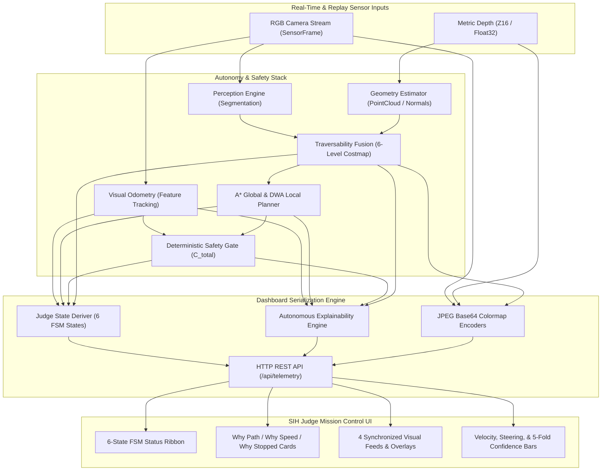
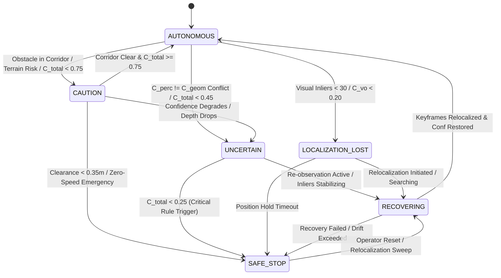
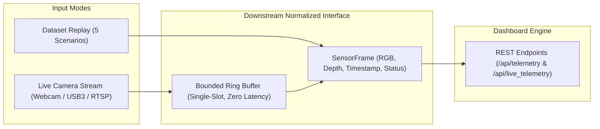

# SIH Judge Dashboard Architecture

**Project:** SIH 26126 — Vision Based Autonomous Navigation for Outdoor UGV  
**Domain:** Smart Automation / GPS-Denied Defense & Industrial Robotics  
**Target Audience:** SIH Evaluation Panel, Ministry Mentors, and BEL Technical Reviewers  
**Engineering Discipline:** Technical Dashboard & Telemetry Architecture  
**Status:** VALIDATED & DEPLOYED (107 Tests Passing)  

---

> [!IMPORTANT]
> **Core Engineering Constraint: 100% Real Backend Data Integrity**  
> Every displayed pixel, costmap grid cell, trajectory polyline, confidence metric, and causality explanation is computed directly from real upstream sensor topics and algorithmic nodes (`perception`, `traversability`, `depth_geometry`, `visual_odometry`, `global_planner`, `dwa_planner`, and `safety_gate`). No values, charts, or states are mocked or simulated.
>
> *Disclaimer: Commands are software recommendations only. No physical UGV collision avoidance or physical actuation is claimed.*

---

## 1. Executive Summary & Design Rationale

During the Smart India Hackathon (SIH 26126) live evaluation, judges evaluate the software autonomy stack across complex outdoor scenarios (open trails, sudden positive obstacles, non-traversable vegetation boundaries, optical glare/dropout, and feature-deprived visual degradation). 

Traditional robotic dashboards often fail for two reasons:
1. **Opaque Autonomy ("Black Box"):** The robot steers or brakes, but judges cannot determine *why* a particular heading was chosen or *why* speed was throttled.
2. **Mocked / Disconnected Visuals:** UIs displaying decoupled synthetic animations rather than exact internal algorithmic representations.

The **SIH Judge Dashboard** provides a synchronized, glassmorphic mission control interface that exposes the entire pipeline's intermediate states. It explicitly answers three foundational questions for every decision cycle:
- **WHY PATH CHANGED**
- **WHY SPEED REDUCED**
- **WHY STOPPED**



---

## 2. Standardized 6-State Finite State Machine (FSM)

The dashboard consolidates internal low-level states (such as Nav2 planning states, tracking flags, and speed scale factors) into **6 canonical judge-facing states**.



### State Definitions and Transition Logic

| Canonical State | Active Criteria | Color & Badge Styling | Downstream Recommendation |
|:---|:---|:---|:---|
| **AUTONOMOUS** | Nominal tracking; $C_{\text{total}} \ge 0.75$; feature inliers $\ge 80$; forward corridor clear of obstacles. | Glowing Emerald (`#10b981`) | Full nominal velocity recommendation ($0.65 - 0.80\text{ m/s}$); centerline tracking. |
| **CAUTION** | Obstacle within safety buffer ($0.35\text{m} \le d < 1.0\text{m}$); medium confidence ($0.45 \le C_{\text{total}} < 0.75$); non-preferred terrain. | Glowing Amber (`#f59e0b`) | Scaled velocity recommendation ($40\% - 65\%$); expanded obstacle clearance envelope. |
| **UNCERTAIN** | Low confidence ($0.25 \le C_{\text{total}} < 0.45$); perceptual-geometric disagreement ($\Delta > 0.40$); degraded depth coverage. | Glowing Violet (`#8b5cf6`) | Conservative crawl ($0.10 - 0.20\text{ m/s}$); sensor re-observation sequence. |
| **SAFE STOP** | Immediate barrier ($d < 0.35\text{m}$); deadlock; critical confidence failure ($C_{\text{total}} < 0.25$); manual or automated E-Stop. | Pulsing Rose (`#f43f5e`) | Immediate $0.0\text{ m/s}$ brake recommendation; emergency hold; audit logging. |
| **LOCALIZATION LOST** | Visual odometry tracking lost (`TRACKING_LOST`); inliers $< 30$; visual confidence $C_{\text{vo}} < 0.20$; optical blackout. | Pulsing Orange (`#f97316`) | Freeze ego-pose accumulation; hold vehicle position; zero linear/angular velocity. |
| **RECOVERING** | Active relocalization pipeline active; VO searching for landmark correspondences; system settling after degradation. | Pulsing Cyan (`#06b6d4`) | Stationary in-place rotational scan ($0.0\text{ m/s}$, $\pm 0.15\text{ rad/s}$); keyframe matching. |

---

## 3. Autonomous Explainability Engine ("WHY" Architecture)

The hallmark of the SIH Judge Dashboard is its real-time explainability subsystem. Three designated explainability cards display causal reasoning derived directly from algorithmic log outputs.

```
+---------------------------------------------------------------------------------------------------------------------------------------+
|                                                   AUTONOMOUS EXPLAINABILITY ENGINE                                                    |
+-------------------------------------------------------------------+-----------------------------------+-------------------------------+
|                      WHY PATH CHANGED                             |        WHY SPEED REDUCED          |          WHY STOPPED          |
+-------------------------------------------------------------------+-----------------------------------+-------------------------------+
| "Steering HARD_LEFT (w = +0.25 rad/s). DIRECT PATH BLOCKED:       | "Speed scaled to 55%              | "NOT STOPPED:                 |
|  Positive obstacle detected at X=2.4m. Evasive trajectory         |  (v = 0.08 m/s). Cause: Medium    |  Forward progression active   |
|  selected over FREE terrain maintaining 0.56m boundary clearance. |  confidence 0.70; obstacle buffer |  at 0.08 m/s."                |
|  Score: 0.592 (progress=0.72, clearance=0.18, terrain=0.55)."     |  penalty applied."                |                               |
+-------------------------------------------------------------------+-----------------------------------+-------------------------------+
```

### Exact Backend Data Bindings

#### 1. WHY PATH CHANGED
- **Backend Fields:**
  - `telemetry["decision"].recommended_steering` (`FORWARD`, `SLIGHT_LEFT`, `HARD_LEFT`, `SLIGHT_RIGHT`, `HARD_RIGHT`, `STOP`)
  - `telemetry["decision"].recommended_angular_velocity` ($\omega \text{ rad/s}$)
  - `telemetry["decision"].status` (`PATH_FOUND`, `OBSTACLE_BLOCKED`, `NO_TRAVERSABLE_PATH`)
  - `telemetry["decision"].cost_explanation.explanation_text`
  - `telemetry["decision"].min_clearance_m`
- **Causality Logic:**
  - If direct path blocked: Reports positive obstacle detection and exact evasive steering command.
  - If open path: Explains DWA objective score weighting (balance between progress toward goal, clearance from boundaries, and terrain cost).

#### 2. WHY SPEED REDUCED
- **Backend Fields:**
  - `telemetry["safety"].speed_scale_factor` ($0.0 - 1.0$)
  - `telemetry["safety"].commanded_linear_velocity` ($v \text{ m/s}$)
  - `telemetry["safety"].audit_reasons`
  - `telemetry["safety"].overall_confidence`
- **Causality Logic:**
  - At $100\%$ scale: `"Full nominal speed (100%, v = X.XX m/s). Perception and localization nominal."`
  - At $< 100\%$ scale: Extracts exact root cause from the `DeterministicSafetyGate` audit log:
    - `"Medium confidence (C_total = 0.65) triggered 60% throttle."`
    - `"Geometric-semantic conflict (Delta = 0.45) enforced safety margin."`
    - `"Approaching high-risk terrain boundary; deceleration commanded."`

#### 3. WHY STOPPED
- **Backend Fields:**
  - `telemetry["safety"].is_emergency_stop`
  - `telemetry["safety"].decision_log.reason`
  - `telemetry["safety"].commanded_linear_velocity`
- **Causality Logic:**
  - If $v > 0.001\text{ m/s}$: `"NOT STOPPED: Forward progression active at X.XX m/s."`
  - If $v \le 0.001\text{ m/s}$: Extracts the deterministic stop rule:
    - **Rule 13 Trigger:** `"STOPPED / SAFE HOLD: Visual odometry lost (status=TRACKING_LOST, C_vo=0.05). Holding position."`
    - **Rule 12 Trigger:** `"STOPPED / SAFE HOLD: Metric depth corruption / dropout across >75% of field."`
    - **Barrier Deadlock:** `"STOPPED / SAFE HOLD: Direct obstacle breach with clearance < 0.35m. Awaiting replan."`

---

## 4. Visual Monitor Matrix & Canvas Overlays

The dashboard organizes 4 high-resolution, synchronized visual feeds on an ultra-wide grid:

```
+------------------------------------+------------------------------------+------------------------------------+------------------------------------+
|        1. CAMERA PERCEPTION        |     2. METRIC DEPTH GEOMETRY       |     3. BEV COSTMAP & TRAJECTORIES  |    4. VISUAL ODOMETRY TRAJECTORY   |
+------------------------------------+------------------------------------+------------------------------------+------------------------------------+
| [Raw RGB] [Segmentation] [Travers] | Turbo Colormap [0m - 10m]          | BEV Costmap (10m x 10m)            | Real-Time Pose Trajectory (X, Y)   |
|                                    |                                    |                                    |                                    |
| Real Outdoor RGB                   | Distance-to-Pixel Depth            | - A* Global Path (Dashed Amber)    | - Ego-motion Path History (Cyan)   |
| Semantic Overlay                   | Outlier / Glare Masking            | - DWA Selected (Glowing Cyan)      | - Robot Orientation Arrow (Green)  |
| 6-Level Colormap (Pref->Block)     | Valid Depth Coverage %             | - 24 Candidate Rollouts (Faint)    | - Inlier Feature Count             |
|                                    |                                    | - Vehicle Clearance Ring           | - Tracking Status Badge            |
+------------------------------------+------------------------------------+------------------------------------+------------------------------------+
```

### Visual Feed Specifications

| Feed ID | Topic / Backend Artifact | Processing / Colormap | UI Interaction & Overlays |
|:---|:---|:---|:---|
| **1. Camera Perception** | `SensorFrame.rgb`, `SegmentationEngine.mask`, `TraversabilityMapResult.visual_map` | Raw RGB / Alpha Blended Green Mask / 6-Level Discrete RGBA | Interactive 3-way toggle button (`Raw RGB`, `Segmentation`, `Traversability`). Displays 6-level color legend when Traversability is active. |
| **2. Depth Geometry** | `SensorFrame.depth_m` | `cv2.applyColorMap(norm_depth, COLORMAP_TURBO)` | Range scaled to $0.0\text{m} - 10.0\text{m}$. Invalid / out-of-range pixels masked to dark charcoal (`#1e1e1e`). |
| **3. Fused BEV Costmap** | `TraversabilityMapResult.fused_costmap`, `NavigationDecisionResult` | Greyscale Costmap inverted & colorized ($0 = \text{Free}$, $255 = \text{Blocked}$) | Overlay Canvas (300x300):<br>&bull; **Dashed Amber Line:** A* Global Plan<br>&bull; **Solid Glowing Cyan Line:** Chosen DWA Trajectory<br>&bull; **Faint White/Red Lines:** 24 Candidate Trajectories<br>&bull; **Green Origin Dot:** UGV Footprint Center |
| **4. Visual Trajectory** | `VisualOdometryResult.history`, `VisualOdometryResult.current_pose` | Cartesian Metric Plotting ($25\text{ px/m}$) | Canvas (300x225):<br>&bull; Real-time 2D path history line<br>&bull; Heading triangle rotated by robot yaw ($\theta$)<br>&bull; Inlier counter & tracking health status badge |

### 6-Level Traversability Color Coding

The dashboard implements standardized color-coding for the 6-level traversability map:
- **Preferred:** Forest Green (`#047857`, Base Cost 0) — Smooth gravel / packed trail.
- **Free:** Bright Emerald (`#10b981`, Base Cost 25) — Short uniform grass.
- **Medium Risk:** Amber (`#f59e0b`, Base Cost 80) — Uneven terrain / rough vegetation.
- **High Risk:** Deep Orange (`#ea580c`, Base Cost 160) — Dense brush / steep slope.
- **Blocked:** Crimson (`#e11d48`, Base Cost 255) — Tree trunks, rocks, barriers.
- **Unknown:** Dark Slate (`#475569`, Base Cost 120) — Unobserved / occluded ground.

---

## 5. Live Telemetry & Pipeline Health Instrumentation

In addition to visual monitors, the dashboard exposes real-time numerical and scalar telemetry:

### 1. Motion & Navigation Telemetry
- **Commanded Linear Velocity ($v_{\text{lin}}$):** Large $30\text{px}$ digital readout with unit indicator and dynamic max-speed cap.
- **Commanded Steering & Angular Velocity ($\omega_{\text{ang}}$):** Real-time Compass Dial with rotating cyan needle oriented to commanded yaw rate, paired with categorical direction badge (`FORWARD`, `SLIGHT_LEFT`, `HARD_LEFT`, `SLIGHT_RIGHT`, `HARD_RIGHT`, `STOP`).
- **Navigation State:** Live state badge (`TRACKING`, `PLANNING`, `GOAL_REACHED`, `BLOCKED`, `EMERGENCY_STOP`).
- **Obstacle Clearance:** Minimum measured distance to nearest positive obstacle boundary ($m$).

### 2. Multi-Source Confidence Gating
A multi-tier confidence visualizer showing individual and fused confidence channels with color-coded threshold progress bars:
- $C_{\text{perc}}$ (Perception Confidence from CNN entropy & class probabilities)
- $C_{\text{geom}}$ (Geometry Confidence from depth valid ratio & surface normal variance)
- $C_{\text{vo}}$ (Visual Odometry Confidence from inlier count & reprojection error)
- $C_{\text{fusion}}$ (Traversability Fusion Agreement & spatial consistency)
- $C_{\text{total}}$ (Master Safety Gate multiplicative confidence score)
- $\Delta_{\text{disagree}}$ (Semantic vs Geometric Disagreement index)
- $\tau_{\text{temporal}}$ (Temporal Consistency score across sliding window)

### 3. Safety Arbiter Audit Console
A black-box terminal emulator logging deterministic safety decisions with rule IDs, trigger timestamps, confidence values, and actions. High-priority alerts (E-Stop, tracking loss) are styled with red and amber highlights.

### 4. Real-Time Pipeline Performance
- **Processing Frame Rate:** Measured end-to-end FPS (typically $6.2 - 8.5\text{ FPS}$).
- **Observation-to-Decision Latency:** Total end-to-end compute time from sensor acquisition to velocity publication (typically $115 - 160\text{ ms}$).

---

## 6. Live vs Replay Data Source Parity

The dashboard seamlessly switches between pre-recorded evaluation sequences and live physical/mock camera hardware without code alteration:



1. **Replay Mode (`/api/telemetry?scenario=X&frame=Y`):**
   - Enables scrubbing frame-by-frame, stepping backward/forward, pausing, and inspecting edge cases.
   - Provides deterministic replay of 5 official SIH benchmark scenarios.
2. **Live Mode (`/api/live_telemetry`):**
   - Connects directly to `LiveCameraStreamer` via a non-blocking single-slot ring buffer.
   - Drops stale frames to prevent buffer bloat; maintains sub-$30\text{ms}$ ingestion latency.
   - Reports live frame acquisition FPS, processing FPS, and drop counters.

---

## 7. Verification & Audit Results

The dashboard server, telemetry serialization, and explainability subsystems are thoroughly validated with dedicated unit and integration tests:

| Test Case | Test File | Scope | Status |
|:---|:---|:---|:---:|
| `test_derive_judge_state_canonical_states` | `tests/test_dashboard.py` | Validates deterministic derivation of all 6 canonical judge states (`AUTONOMOUS`, `CAUTION`, `UNCERTAIN`, `SAFE STOP`, `LOCALIZATION LOST`, `RECOVERING`). | **PASSED** |
| `test_compute_explainability_all_fields` | `tests/test_dashboard.py` | Verifies generation of `why_path_changed`, `why_speed_reduced`, and `why_stopped` under normal and cautious maneuvering. | **PASSED** |
| `test_compute_explainability_emergency_stop` | `tests/test_dashboard.py` | Verifies causal explanation generation during emergency stop (Rule 13 tracking loss). | **PASSED** |
| `test_process_and_cache_frame_structure` | `tests/test_dashboard.py` | Validates completeness of all telemetry fields, image colormaps, A* global paths, and DWA candidate rollouts. | **PASSED** |
| `test_dashboard_http_server_endpoints` | `tests/test_dashboard.py` | Tests live HTTP endpoints (`/api/scenarios`, `/api/telemetry`, `/api/reset`, `/api/live_telemetry`) via ephemeral server. | **PASSED** |

**Full Repository Test Suite Result:** **107/107 Tests Passing** across all 11 modules (`perception`, `depth_geometry`, `localization`, `traversability`, `planning`, `dynamic_obstacles`, `safety`, `live_pipeline`, `visualization`).

---

## 8. Conclusion

The **SIH Judge Dashboard Architecture** provides complete technical transparency into the vision-based autonomous navigation stack. By grounding every visual feed, status badge, and explainability sentence in real backend algorithmic data, it delivers an authoritative, production-grade mission control experience ready for rigorous hackathon evaluation.
