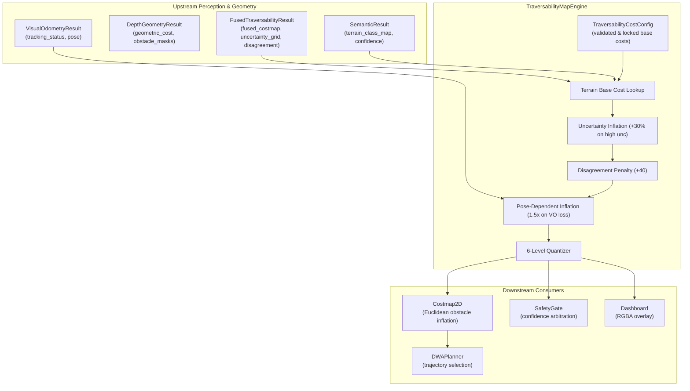

# Traversability Map Engine Architecture & Implementation

**Role:** Traversability-Map Engineer  
**Component:** `src/traversability/`  
**Purpose:** Unified, configurable multimodal traversability representation bridging AI Perception, 3D Depth Geometry, Visual Odometry, and DWA Local Navigation Planning.

---

## 1. Architectural Overview

The Traversability Map Engine synthesizes multimodal sensor evidence into 4 synchronized representations:
1. **Level Grid (`level_grid`):** 6-level quantized traversability (`PREFERRED`, `FREE`, `MEDIUM_RISK`, `HIGH_RISK`, `BLOCKED`, `UNKNOWN`).
2. **Cost Grid (`cost_grid`):** Navigation-ready `uint8` [0..255] costmap incorporating uncertainty inflation, disagreement penalties, and localization degradation scaling.
3. **Obstacle Grid (`obstacle_grid`):** Binary lethal obstacle mask (enforcing monotonic safety as a strict superset of upstream obstacles).
4. **Uncertainty Grid (`uncertainty_grid`):** Spatial uncertainty distribution [0.0..1.0] passed to safety monitoring gates.
5. **Visual Overlay (`visual_map`):** RGBA color-coded overlay for operator visualization and real-time dashboard display.



---

## 2. Six-Level Traversability Classification

| Level | Value | Cost Band (uint8) | Color (RGBA) | Semantic Definition | UGV Motion Behavior |
| :--- | :---: | :---: | :--- | :--- | :--- |
| **PREFERRED** | 0 | 0 – 19 | `(46, 204, 113, 192)` [Green] | Smooth asphalt, compact dirt path | Full target speed (0.80 m/s) |
| **FREE** | 1 | 20 – 79 | `(130, 224, 170, 192)` [Lime] | Low grass, packed gravel, minor roughness | Nominal cruising speed (0.50–0.60 m/s) |
| **MEDIUM_RISK** | 2 | 80 – 179 | `(244, 208, 63, 192)` [Yellow] | High vegetation, multi-sensor disagreement | Cautious speed cap (0.35 m/s) |
| **HIGH_RISK** | 3 | 180 – 219 | `(230, 126, 34, 192)` [Orange] | Water puddles, high uncertainty | Crawl speed (0.15 m/s) |
| **BLOCKED** | 4 | 220 – 254 | `(231, 76, 60, 192)` [Red] | Solid obstacles, impassable drops | Zero velocity / evasive steering |
| **UNKNOWN** | 5 | 255 | `(149, 165, 166, 64)` [Gray] | Unobserved terrain outside camera FOV | Avoided; never treated as free space |

---

## 3. Locked Configuration (`TraversabilityCostConfig`)

Empirically validated via ±50% sensitivity sweeps across 75 outdoor frames:

```python
@dataclass
class TraversabilityCostConfig:
    # Level upper thresholds (inclusive)
    preferred_max: int = 19
    free_max: int = 79
    medium_risk_max: int = 179
    high_risk_max: int = 219
    blocked_max: int = 254

    # Per-TerrainClass locked base costs
    terrain_base_costs: Dict[int, int] = field(default_factory=lambda: {
        0: 255,  # UNKNOWN
        1: 5,    # PAVED_ROAD
        2: 12,   # TRAVERSABLE_DIRT
        3: 35,   # LOW_GRASS
        4: 50,   # GRAVEL
        5: 120,  # HIGH_VEGETATION
        6: 240,  # OBSTACLE_SOLID
        7: 190,  # WATER_PUDDLE
    })

    # Inflation & Penalties
    uncertainty_cost_weight: float = 0.30
    high_uncertainty_thresh: float = 0.70
    disagreement_cost_penalty: int = 40
    unknown_cost: int = 255

    # Localization degradation scaling
    localization_lost_inflation: float = 1.50
    degraded_tracking_inflation: float = 1.15
```

---

## 4. Verification & Testing

The implementation is verified by:
1. `tests/test_traversability_map.py` (17 tests): Unit testing level classification, Rule 11 unknown enforcement, uncertainty penalties, disagreement penalties, and VO inflation.
2. `tests/test_sensitivity_sweep.py` (3 tests): Full pipeline replay verification across real outdoor scenarios.
3. `tests/test_costmap.py` & `tests/test_planner.py`: Costmap integration and DWA trajectory evaluation.
