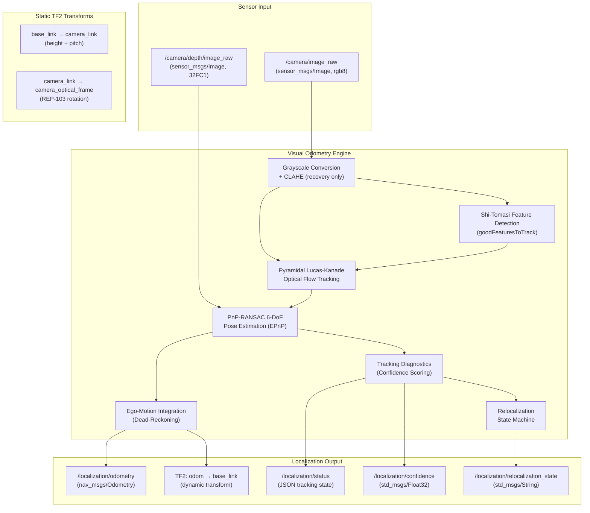
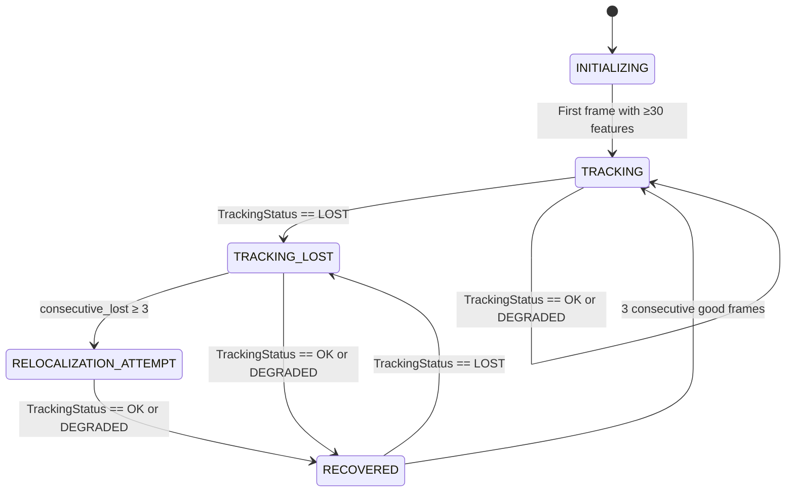

# Visual Localization Architecture

**Project:** SIH 26126 — Vision Based Autonomous Navigation for UGV  
**Subsystem:** Visual Localization (GPS-Denied)  
**Status:** Implemented & Validated on Recorded Outdoor Data  

> [!IMPORTANT]
> This system is validated exclusively on recorded real outdoor sensor data.  
> We do **NOT** claim physical UGV localization.

---

## 1. Architecture Overview



---

## 2. TF Tree Specification (REP-103 / REP-105)

```
map ─── odom ─── base_link ─── camera_link ─── camera_optical_frame
 │       │            │              │                  │
 │  (SLAM loop    (Visual       (Static:           (Static:
 │   closure)    Odometry)     h=0.45m,          REP-103
 │  Identity     Dynamic       pitch=12°)        90° rotation)
 │  until        Transform
 │  RTAB-Map
 │  deployed)
```

| Transform | Type | Source | Rate |
| :--- | :--- | :--- | :--- |
| `map → odom` | Dynamic | SLAM backend (identity until RTAB-Map) | 1-5 Hz |
| `odom → base_link` | Dynamic | Visual Odometry Node | 10-30 Hz |
| `base_link → camera_link` | Static | Launch params / URDF | Once |
| `camera_link → camera_optical_frame` | Static | REP-103 convention | Once |

---

## 3. Camera Calibration Parameters

| Parameter | Value | Unit | Description |
| :--- | :--- | :--- | :--- |
| `fx` | 385.0 | px | Horizontal focal length |
| `fy` | 385.0 | px | Vertical focal length |
| `cx` | 320.0 | px | Principal point X |
| `cy` | 240.0 | px | Principal point Y |
| `width` | 640 | px | Image width |
| `height` | 480 | px | Image height |
| `k1, k2, p1, p2` | 0.0 | — | Pre-rectified (zero distortion) |
| `baseline_m` | 0.05 | m | Stereo baseline |
| `camera_height_m` | 0.45 | m | Height above ground in base_link |
| `camera_pitch_rad` | 0.209 | rad | Downward tilt (~12°) |

---

## 4. Relocalization State Machine



### State Descriptions

| State | Behavior | Feature Detection | LK Window |
| :--- | :--- | :--- | :--- |
| `INITIALIZING` | First frame, no prior history | Default (quality=0.015) | 21×21 |
| `TRACKING` | Nominal operation | Default (quality=0.015) | 21×21 |
| `TRACKING_LOST` | Inliers < 8, consecutive losses < 3 | Recovery (quality=0.008) | 31×31 |
| `RELOCALIZATION_ATTEMPT` | Consecutive losses ≥ 3, aggressive recovery | Recovery + CLAHE equalization | 31×31 |
| `RECOVERED` | First good frame after loss, stabilizing | Recovery (quality=0.008) | 21×21 |

### Recovery Heuristics

1. **CLAHE Histogram Equalization:** Applied to grayscale images during `TRACKING_LOST` and `RELOCALIZATION_ATTEMPT` states to improve feature detection under extreme lighting variation.
2. **Relaxed Feature Quality Threshold:** Reduced from 0.015 to 0.008 to detect more candidate keypoints in low-texture regions.
3. **Wider LK Optical Flow Window:** Expanded from 21×21 to 31×31 pixels during loss states to handle larger inter-frame displacements.
4. **Additional Pyramid Level:** LK pyramid levels increased from 3 to 4 during recovery.

---

## 5. ROS 2 Topic Contract

### Subscriptions

| Topic | Type | QoS | Description |
| :--- | :--- | :--- | :--- |
| `/camera/image_raw` | `sensor_msgs/Image` | BEST_EFFORT, depth=5 | RGB camera frame |
| `/camera/depth/image_raw` | `sensor_msgs/Image` | BEST_EFFORT, depth=5 | Depth map (32FC1 or 16UC1) |

### Publications

| Topic | Type | QoS | Rate | Description |
| :--- | :--- | :--- | :--- | :--- |
| `/localization/odometry` | `nav_msgs/Odometry` | RELIABLE, depth=10 | ~10 Hz | 6-DoF pose + twist |
| `/localization/status` | `std_msgs/String` | RELIABLE, depth=10 | ~10 Hz | JSON tracking state |
| `/localization/confidence` | `std_msgs/Float32` | RELIABLE, depth=10 | ~10 Hz | Scalar confidence [0,1] |
| `/localization/relocalization_state` | `std_msgs/String` | RELIABLE, depth=10 | ~10 Hz | State machine state |

### Configurable Parameters

| Parameter | Type | Default | Description |
| :--- | :--- | :--- | :--- |
| `max_features` | int | 400 | Maximum Shi-Tomasi features per frame |
| `odom_frame_id` | str | `odom` | Odometry TF parent frame |
| `base_frame_id` | str | `base_link` | Robot base TF frame |
| `camera_frame_id` | str | `camera_optical_frame` | Camera optical TF frame |
| `fx`, `fy` | float | 385.0 | Camera focal lengths |
| `cx`, `cy` | float | 320.0, 240.0 | Camera principal point |
| `camera_height_m` | float | 0.45 | Camera mount height |
| `camera_pitch_rad` | float | 0.209 | Camera downward pitch |

---

## 6. Integration with Safety Gate

The localization confidence is consumed by the deterministic `SafetyGate` module:

```python
safety_gate.arbitrate(
    ...
    c_vo=odometry.confidence,          # VO confidence [0.0, 1.0]
    tracking_status=odometry.tracking_status,  # TRACKING_OK / DEGRADED / LOST
    ...
)
```

| VO Tracking Status | Safety Gate Response |
| :--- | :--- |
| `TRACKING_OK` (conf ≥ 0.75) | `HIGH_CONFIDENCE` — Full speed |
| `TRACKING_DEGRADED` (conf 0.35–0.65) | `CAUTIOUS_DEGRADED` — Reduced speed |
| `TRACKING_LOST` (conf < 0.25) | `LOCALIZATION_LOST` → `SAFETY_STOP` |

---

## 7. Measured Performance on Real Outdoor Data

### Per-Scenario Results

| Test ID | Scenario | OK | DEG | LOST | Loss Episodes | Recoveries | Mean Latency | FPS |
| :--- | :--- | :---: | :---: | :---: | :---: | :---: | :---: | :---: |
| LOC-01 | High texture (grass + structures) | 15 | 0 | 0 | 0 | 0 | 3.7 ms | 123.4 |
| LOC-02 | Sudden obstacle (mixed terrain) | 15 | 0 | 0 | 0 | 0 | 3.0 ms | 140.9 |
| LOC-03 | Vegetation boundary (texture transition) | 15 | 0 | 0 | 0 | 0 | 2.9 ms | 144.2 |
| LOC-04 | Depth degradation (lighting change analog) | 15 | 0 | 0 | 0 | 0 | 2.6 ms | 147.8 |
| LOC-05 | Visual degradation (low texture + obstruction) | 5 | 0 | 10 | 5 | 4 | 9.3 ms | 80.2 |
| LOC-06 | Camera vibration (synthetic jitter) | 15 | 0 | 0 | 0 | 0 | 5.6 ms | 85.4 |

### Aggregate (LOC-07)
- **Total Frames:** 90
- **OK:** 80 | **LOST:** 10
- **Successful Recoveries:** 4
- **Average Latency:** 4.5 ms

---

## 8. Structured Per-Frame Logging

Every frame produces a JSON-lines log record in `logs/localization/`:

```json
{
  "frame_index": 7,
  "timestamp": 0.7,
  "x": 0.0023,
  "y": -0.0001,
  "yaw": 0.0005,
  "tracking_status": "TRACKING_OK",
  "relocalization_state": "TRACKING",
  "confidence": 0.9534,
  "inlier_count": 342,
  "latency_ms": 3.127,
  "consecutive_lost_frames": 0,
  "recovery_frame_count": 0
}
```
